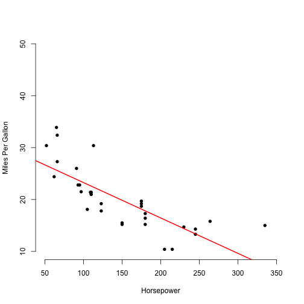

shinyapppitch
========================================================
author: Jeremi_Shane
date: 5/16/2018
autosize: true

Welcome to my Shiny App project
========================================================

- Pitch presentation (you are reading now)
- Shiny App (https://jeremishane.shinyapps.io/finalproject/)
- The app includes documentation on how to use it.  Just simply set the slider.

Predict MPG From Horsepower of a Car
========================================================


```r
model1 <- lm(mpg ~ hp, data=mtcars)
summary(model1)
```

```

Call:
lm(formula = mpg ~ hp, data = mtcars)

Residuals:
    Min      1Q  Median      3Q     Max 
-5.7121 -2.1122 -0.8854  1.5819  8.2360 

Coefficients:
            Estimate Std. Error t value Pr(>|t|)    
(Intercept) 30.09886    1.63392  18.421  < 2e-16 ***
hp          -0.06823    0.01012  -6.742 1.79e-07 ***
---
Signif. codes:  0 '***' 0.001 '**' 0.01 '*' 0.05 '.' 0.1 ' ' 1

Residual standard error: 3.863 on 30 degrees of freedom
Multiple R-squared:  0.6024,	Adjusted R-squared:  0.5892 
F-statistic: 45.46 on 1 and 30 DF,  p-value: 1.788e-07
```

Linear Model Plot
========================================================



Link to Shiny App
========================================================

https://jeremishane.shinyapps.io/finalproject/
